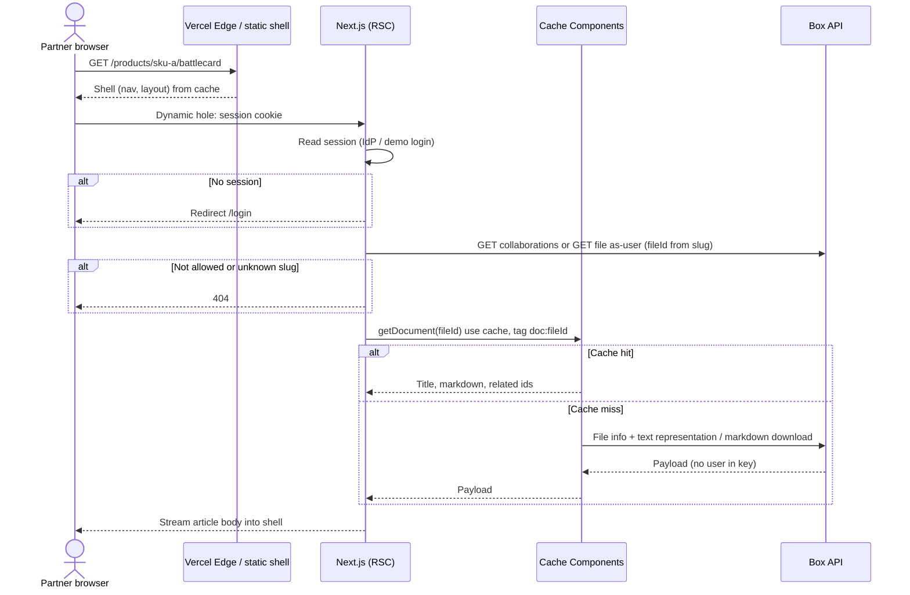
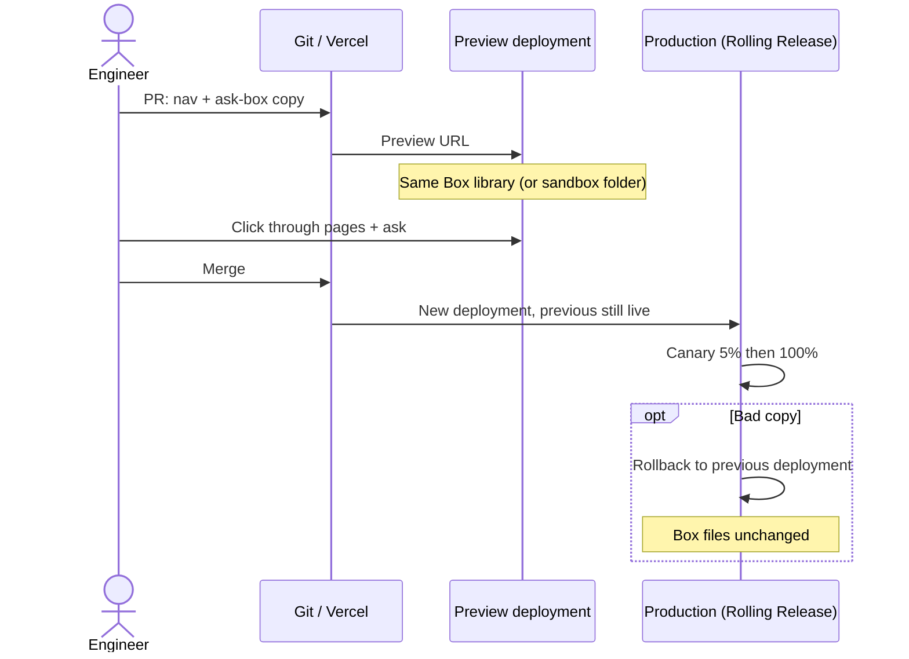

# Sequence diagrams

Happy paths only. Failure notes sit under each diagram.

---

## 1. Partner opens an article

Goal: instant chrome, correct ACL, cached body, no user id in the document cache.



The reader identity lives in the session and the Box ACL call. It is not an argument to `getDocument`.

**If Box is slow:** shell already painted; body streams. Next visitor hits `doc:{id}` cache.

For a PDF, the viewer makes a second gated request. The Function asks Box for a short-lived download URL and returns a private redirect. PDF.js then reads the bytes from Box; the Function does not proxy or cache them.

---

## 2. Author publishes a new version in Box

Goal: one file changes; we do not rebuild the portal.

```mermaid
sequenceDiagram
  actor A as Author
  participant Box as Box
  participant W as Vercel /api/webhooks/box
  participant C as Cache Components

  A->>Box: Upload battlecard v8 (or edit metadata)
  Box->>W: FILE.UPLOADED / METADATA.UPDATED (signed)
  W->>W: Verify signature
  W->>W: Idempotency: event id already seen? drop
  W->>Box: GET file (confirm id, type, parent folder)
  W->>C: revalidateTag("doc:{fileId}", "max")
  opt Title or slug changed
    W->>C: revalidateTag("library:public" or library:partner)
  end
  W-->>Box: 200
  Note over C: Next GET serves stale then refreshes (SWR)
```

Webhooks are Route Handlers. `updateTag` is Server Actions only. `revalidateTag(tag, 'max')` is the webhook primitive.

One webhook URL per environment. Prod webhook → prod. Preview should use a sandbox folder or skip the webhook (TTL only). Today one webhook is registered on prod.

---

## 3. Ask this library

Goal: stream an answer; only files this user can open; citations are **site URLs**.

```mermaid
sequenceDiagram
  actor U as Partner
  participant N as Next.js /api/ask
  participant G as AI Gateway
  participant M as Model
  participant B as Box (search + Box AI)

  U->>N: POST question + current article id when present
  N->>N: Bind Box token as-user
  N->>N: Resolve current article id through catalog and gate
  N->>B: Search all content visible as-user
  B-->>N: accessible file ids
  N->>N: Intersect ids with catalog; put current article first
  N->>B: Box AI Q&A on those ids (as-user)
  B-->>N: answer + file citations
  N->>G: streamText (gated notes + writer fallback)
  G->>M: Compose one answer
  M-->>G: final answer with /products/... links
  G-->>N: token stream
  N-->>U: SSE / UI stream
```

**Never cache this response.** Permissions and wording are per user and per turn.

**Cost/failover:** Each question makes one Gateway request. Gateway retries a second provider if the writer fails.

If Box AI returns nothing, retrieval falls back to a text representation of the shortlist (still as-user, still no Blob copy).

---

## 4. Engineer changes the nav (release path)

Goal: Vercel versions the app; Box is untouched.



This is the sequence to draw on the whiteboard when they say “what does an incident look like?”

---

## 5. Public page (no login)

Same as (1) but skip session. Only files with `audience=public` (or in the public folder). `getDocument` cache is shared — acceptable because the payload is public by policy. Still do not list partner slugs in the public shell.
